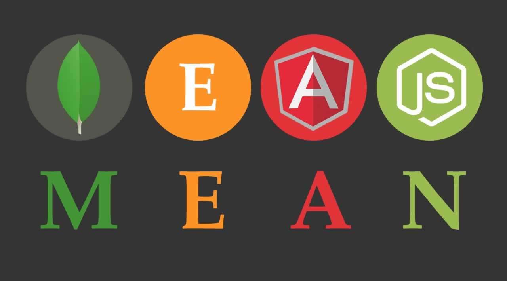
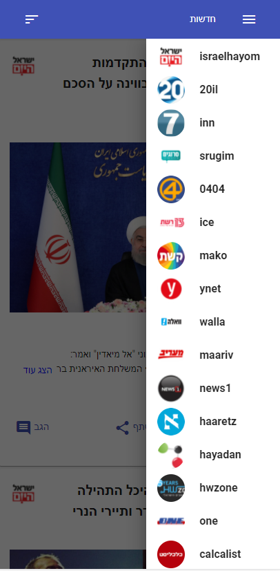
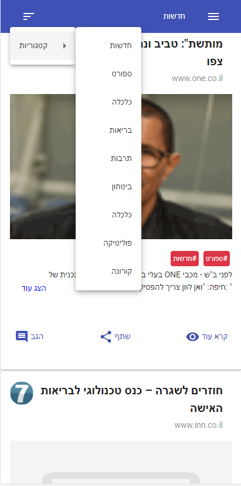
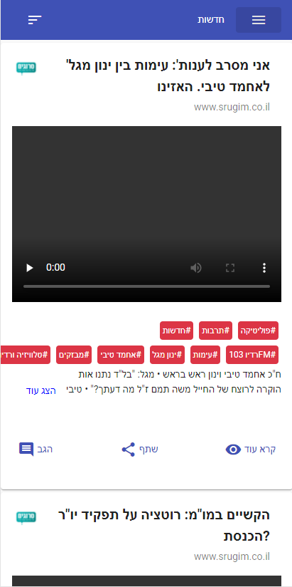
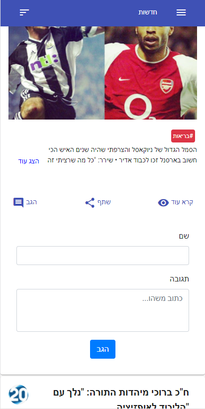

# Israel-News

## Tech



- [Angular]() - A component-based framework for building scalable web
  applications.
  - [TypeScript]() - Programming language that strict syntactical superset of
    JavaScript and adds optional static typing.
  - [Angular-Material]() - Material Design components for Angular.
  - [Bootstrap]() - CSS Framework for developing responsive and mobile-first
    websites.
  - [Jquery]() - JavaScript library that greatly simplifies JavaScript
    programming.
- [NodeJS]() - Node.js is an open source server environment
  - [Express]() - Minimal and flexible Node.js web application framework.
  - [RestApi]() - Application programming interface.
- [cordova]() - Target multiple platforms.

# Web Flow And Features

## Main page.

### News web app, get's online feeds from plenty news API's and group them in one place.


### The user can narrow in serch by favorite news site or by favorite category.





### App with an hashtag article subject.



### The users can comment each subject and article they want.




### The users can share there favorite artcle with others.


## Installation

#### Front-End:

Israel-News required [Angular] V11 to run. Runs on PORT 4200.

```sh
$ npm install
```

**or:**

```sh
$ yarn install
```

#### Back-End:

Israel-News required [Node.js] V12.18.03 to run. Runs on PORT 3000 (for changing
you need to set in the back and the front).

```sh
$ npm install
```

**or:**

```sh
$ yarn install
```

## Activated

#### Front-End:

```sh
$ npm start
```

**or:**

```sh
$ yarn start
```

#### Back-End:

- run with nodemon.

```sh
$ npm run dev
```

**or:**

```sh
$ yarn run dev
```

- **run without nodemon.**

```sh
$ npm run start
```

**or:**

```sh
$ yarn run start
```

## Free Experience

> "You can enjoy free access to **Israel-News** with no download in
> [Click To Open](https://elated-aryabhata-9fce50.netlify.app/) ." or download APK for Android phone file [Click To Download](https://drive.google.com/file/d/1SFPs9l_ZFLaKU8lZ0ISzpPMgEfoMH8oK/view?usp=drivesdk) ."
